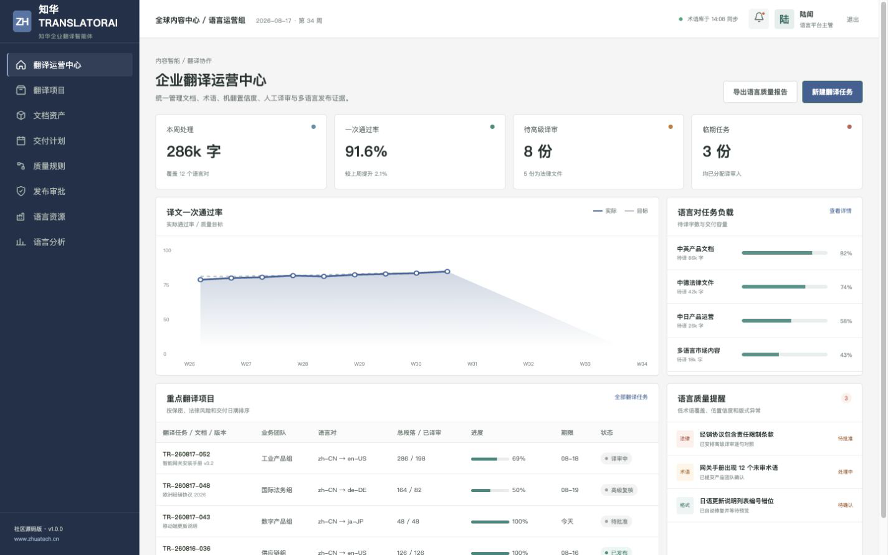
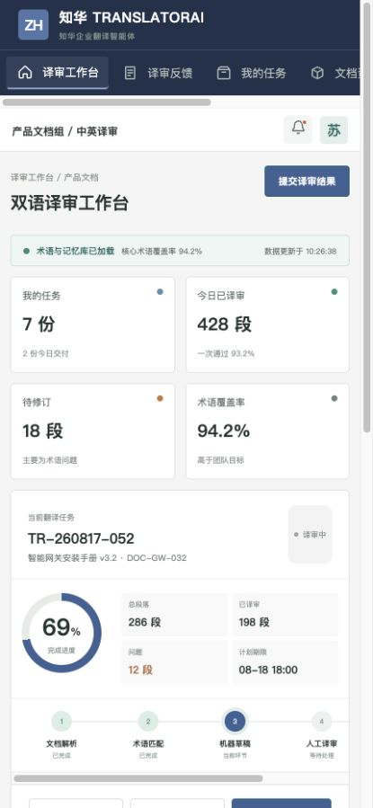

# ZhuaTech TranslatorAI

## 企业多语言内容，从机器草稿到人工发布

TranslatorAI 是知华科技提供的企业翻译与译审协作社区源码版，适用于产品手册、合同、运营内容和多语言网站的流程学习与技术研究。

项目由[上海如静知华信息科技有限公司](https://www.zhuatech.cn/)维护，Java 工程包为 `cn.zhuatech.translatorai`。

### 工作流

1. 解析源文档并识别语言、段落、数字和版式。
2. 匹配企业术语与翻译记忆，生成机器草稿。
3. 根据术语覆盖、模型置信度、保密级别和法律属性计算译审路线。
4. 人工完成双语校对，高风险文档交给高级译审。
5. 保存源文、译文、修订和发布审批证据。



运营端能够看到语言对产能、一次通过率、术语资源、临期任务和发布审批。



移动端展示个人任务、双语反馈、术语资源与保密/法律风险升级。

### 可运行能力

- `POST /api/ai/translation/review-plan`：生成译审分数、风险等级、译审路线、预计工时和检查清单
- 企业术语库、翻译记忆库、模型版本和文档任务台账
- Vue 3 双端界面，Spring Boot REST API，JWT 岗位权限
- MySQL + Flyway、H2 自动化测试、Docker Compose
- 社区版完全本地可测，不上传语料、不需要外部 API Key

### 快速查看

```bash
cd frontend
npm install
npm run dev:demo
```

管理端账号 `planner / Demo@2026`，译审端账号 `operator / Demo@2026`。项目内出现的合同、术语、人员和业务数据均为虚构示例。

技术资料位于 [docs](docs)，部署说明见 [deploy/README.md](deploy/README.md)。

### 许可说明

本工程仅允许个人、非商业性的学习、研究和技术交流，**不得商用**。企业内部使用、生产部署、真实文档处理、SaaS、项目交付、二次销售、品牌替换或收费服务，需获得上海如静知华信息科技有限公司书面授权，具体以 [LICENSE](LICENSE) 为准。

如需企业翻译平台、私有模型、文档智能、软件实施、FDE/软件外包或深度定制，请访问[知华科技官网](https://www.zhuatech.cn/)或扫码联系：

| 企业翻译技术咨询 | 商业授权与定制服务 |
| --- | --- |
|  |  |

SEO：企业翻译 AI、机器翻译、术语库、翻译记忆、双语译审、文档智能、Java Vue 源码、知华科技。

<!-- Copyright 2026 上海如静知华信息科技有限公司 -->
